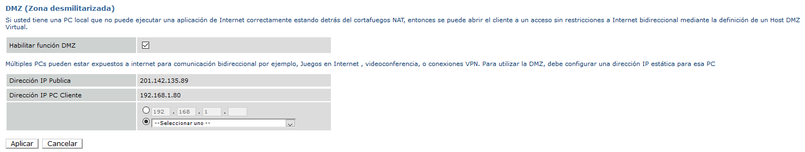
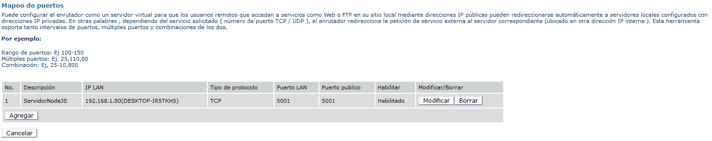

# Sistemas de cómputo y redes - página con nodejs

### instrucciones
## Preparar y correr el servidor en nuestra computadora:
* Instalar NodeJS
  * https://nodejs.org/es/download/
  
* Descargar o clonar este repositorio.
  * https://github.com/fortunatoramirez/redes_pagina_con_nodejs.git

* Con la terminal colocarnos dentro de la carpeta del repositorio y ejecutar el comando *npm install*:
```console
directorio\del\repositorio\redes_pagina_con_nodejs> npm install
```

* Después de haber instalado los paquetes, iniciar el servidor con el comando *npm start*:
```console
directorio\del\repositorio\redes_pagina_con_nodejs> npm start
```
* Comprobar el correcto funcionamiento colocando en nuesto navegador:
```console
http://localhost:5001/
```
se deberá desplegar la página.

## Configurar en nuestro router una zona desmilitarizada y el mapeo de puerto para que el servidor sea 100% público:
* Activar la zona desmilitarizada y agregar la IP de nuestra computadora (la que se encuentra corriendo al servidor NodeJS) a la zona:


* Agregar el mapeo del puerto utilizado, colocando una vez más la IP de nuestra computadora, además del puerto utilizado:


* Investigar la IP pública de nuestro router, por ejemplo:
  * https://www.whatismyip.com/ip-address-lookup/

* Comprobar el funcionamiento del servidor-páginca, colocando nuestra dirección pública en un navegador externo a nuestra red:
```console
http://ip.publica:5001/
```

## Utilizar un servidor DNS gratuito:
* Utilizar un proveedor de nominios gratuitos, por ejemplo:
  * https://www.duckdns.org/

* Registrar nuestra dirección IP a un dominio deseado:


* Verificar el correcto funcionamiento del servidor DNS, colocando el dominio desde un navegador externo a nuestra red. Por ejemplo:
```console
http://redes201.duckdns.org:5001/
```

* Hacer las modificaciones para que no sea necesario indicar el puerto después del dominio. Es decir, poder acceder a nuestra página de la siguiente manera:
```console
http://redes201.duckdns.org/
```
para ello, utilizar el puerto 80.

* Modificar el contenido de la página.
